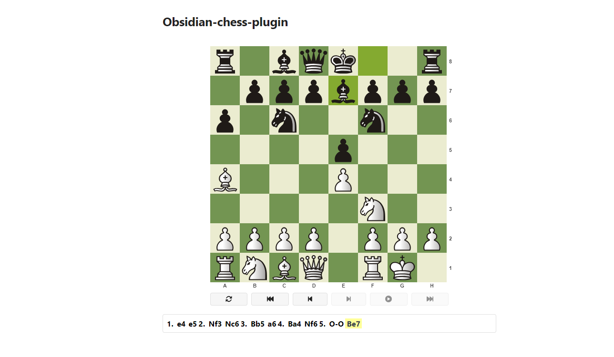
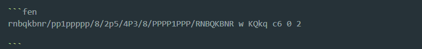
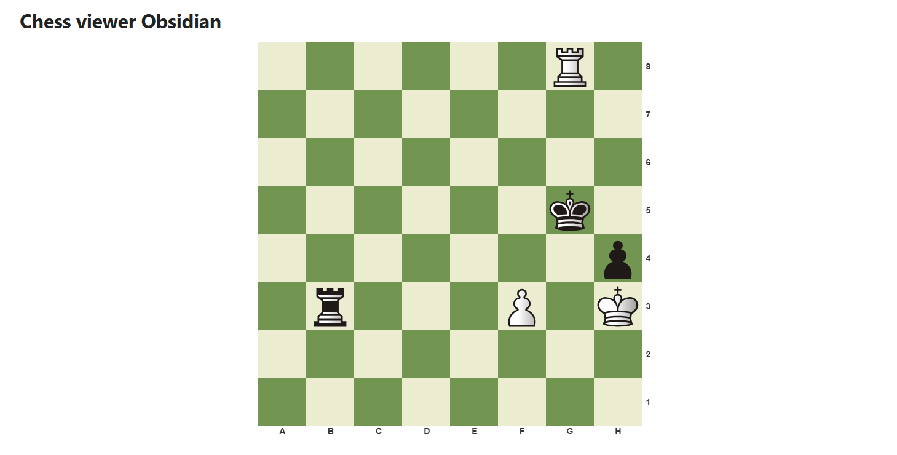

# Obsidian Chess PGN/FEN Viewer

This plugin allows you to view chess games (PGN) and positions (FEN) directly in your Obsidian notes using the `@mliebelt/pgn-viewer` library.

## Features

- **PGN Viewer**: Render full chess games with move lists and navigation.
- **FEN Viewer**: Display static chess positions (boards).
- **Customizable Size**: Adjust the board size via a slider in the plugin settings.
- **Responsive Layout**: Designed to look great within Obsidian's interface.

## Usage

### 1. Rendering PGN
To display a chess game, use the `pgn` code block:

### 2. Rendering FEN
To display a specific board position, use the `fen` code block:

## Settings

Go to `Settings` -> `Chess PGN/FEN Viewer` to adjust the **Board Size**. The size is updated in real-time.

## Installation

### From GitHub (Manual)
1. Download the folder 'obsidian-chess-plugin' with latest release (`main.js`, `manifest.json`, `styles.css`).
2. Move the downloaded folder in your vault's `.obsidian/plugins/` directory.
3. Reload Obsidian and enable the plugin in `Settings` -> `Community plugins`.

---

## Credits

This plugin is powered by the excellent [pgn-viewer](https://github.com/mliebelt/pgn-viewer) library by Markus Liebelt.

## License
MIT

